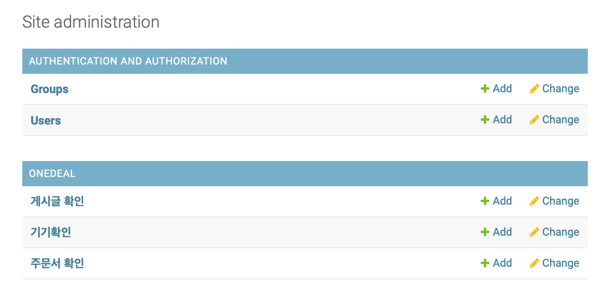
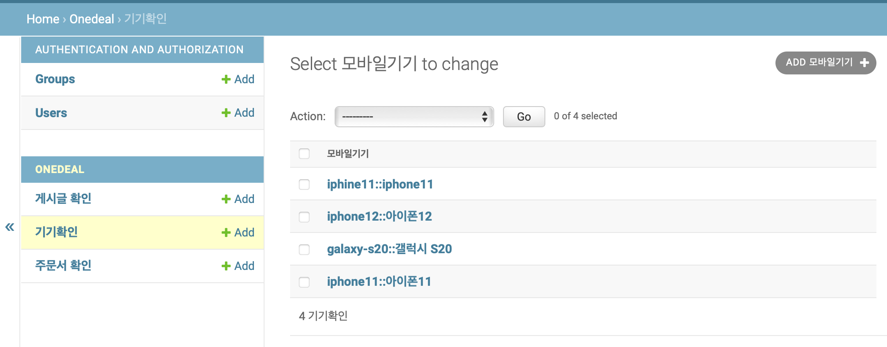
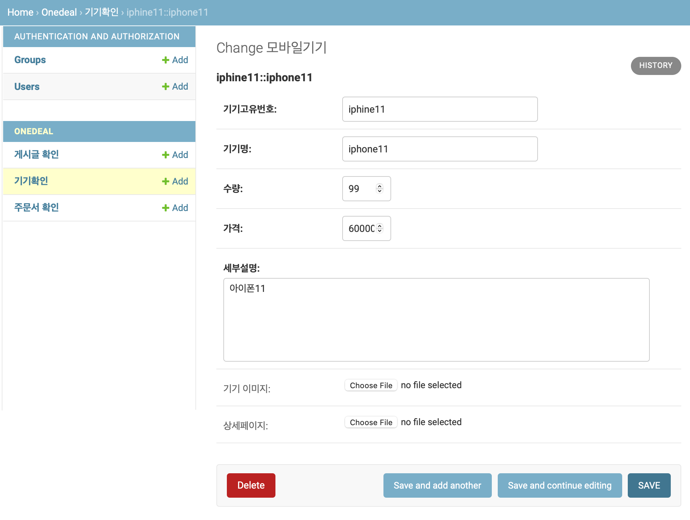
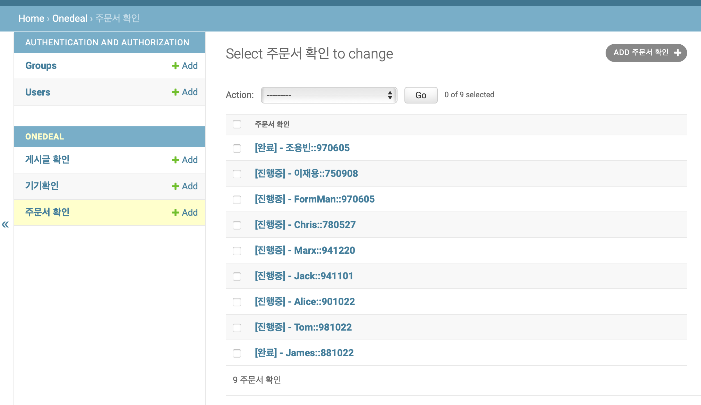
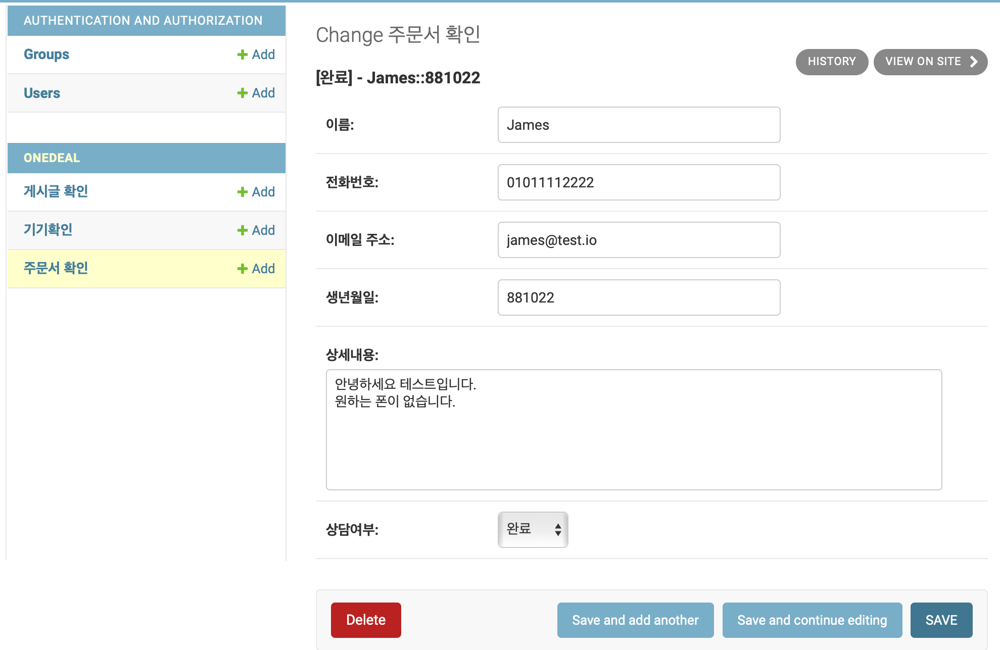
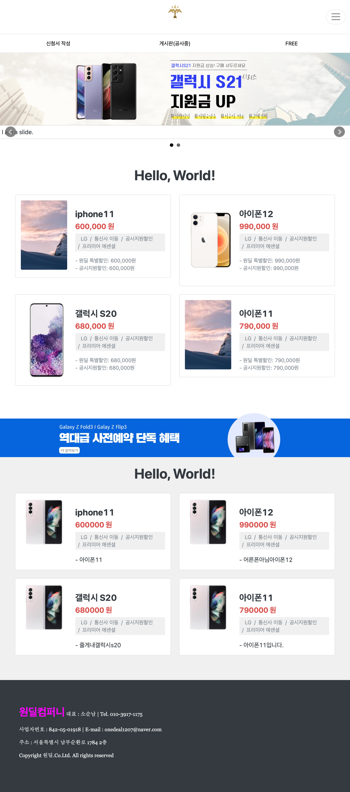

# 원딜 프로젝트

---
 본 프로젝트는 **Onedeal company**의 Online commercial site 제작 프로젝트입니다.
본 프로젝트는 메인 페이지, 신청서 작성 페이지, 유저 게시판 페이지, 이벤트 페이지, 관리자 페이지로 구성됩니다.

### Framework
- [django 3.2.7](https://www.djangoproject.com/)
- [bootstrap 5.0.1](https://getbootstrap.com/) 

### 개요
본 프로젝트는 django에서 지원하는 [ClassBasedView(CBV)](https://docs.djangoproject.com/en/4.0/topics/class-based-views/)
를 활용하여 만들었습니다.

## 1. 관리자 페이지

---
관리자 페이지는 **django에서 기본제공하는 admin 페이지를 활용**하였습니다.
```python
from django.contrib import admin
...
```
관리자 페이지는 본 프로젝트 url을 통해서만 접속할 수 있으며, 관리자 권한을 가진
계정으로만 로그인 할 수 있습니다. 관리자 페이지의 구성은 다음과 같습니다.



관리자 페이지에서는 우선 3개의 탭을 확인할 수 있습니다.
1. 게시글 확인 탭
2. 기기 확인 탭
3. 주문서 확인

위 탭에 구성된 모델 코드는 [여기](onedeal/models.py)에서 확인하실 수 있습니다.
### 1.1 게시글 확인 탭

---
게시글 확인 탭에서는 게시글을 확인할 수 있습니다. 
추후 게시판 페이지의 정책이 확정되었을 때, 사용 가능합니다. <br/>
- 2022.12월 현재 사용 ❌

### 1.2 기기 확인 탭

---
기기 확인 탭의 모습은 다음과 같습니다.




- 기기 확인 탭에서는 <u>기기고유번호::기기명</u> 으로 구분하여 
관리자가 한 눈에 파악하기 쉽도록 하였습니다.
- 기기고유번호, 기기명, 수량, 가격, 세부설명, 기기 이미지, 상세페이지로 데이터를 모델링하였습니다.

### 1.3 주문서 확인 탭

---
주문서 확인 탭의 모습은 다음과 같습니다.




- 주문서 확인 탭에서는 <u>\[상담여부]-이름::생년월일</u> 으로 구분하여
관리자가 한 눈에 파악하기 쉽도록 하였습니다.
  
- 이름, 전화번호, 이메일 주소, 생년월일, 상세내용, 상담여부로 데이터를 모델링하였습니다.

## 2. 메인 페이지

---

메인 페이지의 모습은 다음과 같습니다.



- 페이지 구성은 리스트화 시켜 가독성을 좋게 하였습니다.
- 각 리스트는 db에 들어있는 기기 정보 record를 가져오게 됩니다.

[주요 코드](onedeal/templates/onedeal/item_list.html)는 아래와 같습니다.

```html

        <div class="col-6 pb-4">
          <div class="card">
            <div class="row no-gutters">
              <div class="col-sm-4">
                  
                
                  
                      
                  
    ...
                  

```

- 만약 정보가 없을 경우, 기본 이미지를 보이도록 조건을 걸어놓았습니다.

---
- 2022.12.29 업데이트 완료

